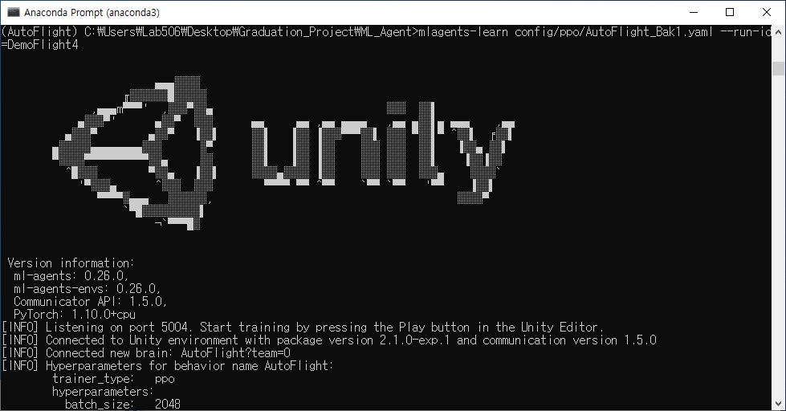
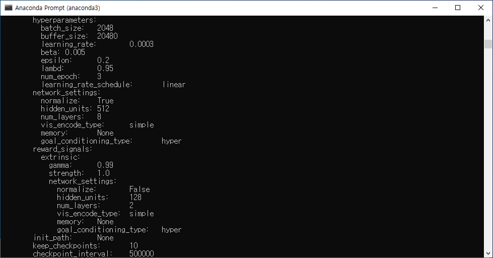
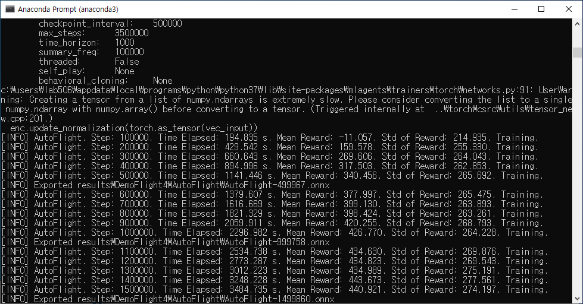
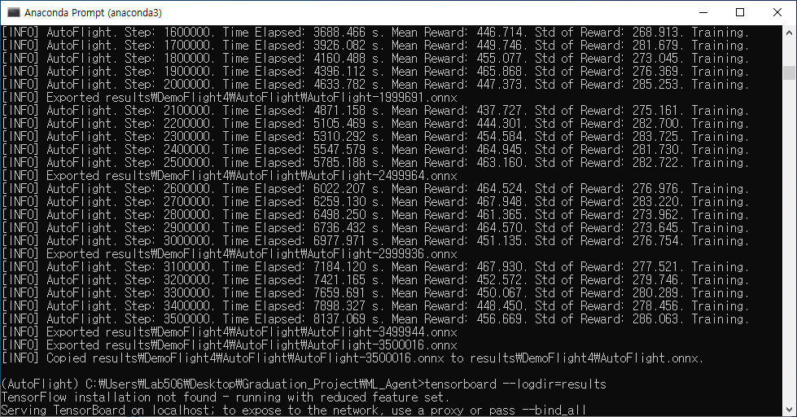

# Auto Flight ML-Agents based on Camera
This Drone Autonomous Flight based on Camera using Unity ML Agent.  
드론 자율비행 기술 중 장애물 회피는 드론이나 주변 환경의 손상을 방지하고 위험을 예방할 수 있도록 하는 매우 중요한 기술이다. LiDAR 센서 기반 장애물 회피방식은 비교적 높은 정확도를 보여 최근 연구에서 많이 활용되고 있지만, 단가가 높고 시각 정보에 대한 처리 능력이 제한적인 단점이 있다. 따라서 본 논문은 단가가 상대적으로 저렴 하고 시각 정보를 이용한 확장성이 높은 카메라 기반 PPO(Proximal Policy Optimization) 강화학습을 이용한 드론의 장애물 회피 알고리즘을 제안한다. 3차원 공간상의 학습환경에서 드론, 장애물, 목표지점 등을 무작위로 위치시키고, 가상 카메라를 이용하여 전면에 설치된 스테레오 카메라를 통해 스테레오 영상정보를 얻은 다음 YOLOv4Tiny 객체 검출을 수행한다. 그리고 난 후 스테레오 카메라의 삼각측량법을 통해 드론과 검출된 객체간의 거리를 측정한다. 이거리를 기반으로 장애물 유무를 판단하고, 만약 장애물이면 패널티를 책정하고 목표지점이면 보상을 부여한다. 본 방법을 실험한 결과 카메라 기반 장애물 회피 알고리즘은 LiDAR 기반 장애물 회피 알고리즘과 비교하여 충분히 비슷한 수준의 높은 정확도와 평균 목표지점 도달시간을 보여 활용 가능성이 높음을 알 수 있었다.
- [Unity ML-Agent](https://github.com/Unity-Technologies/ml-agents): https://github.com/Unity-Technologies/ml-agents
- [YOLOv4 Tiny Barracuda](https://github.com/keijiro/YoloV4TinyBarracuda): https://github.com/keijiro/YoloV4TinyBarracuda
- 연구논문: [카메라 기반 강화학습을 이용한 드론 장애물 회피 알고리즘](https://www.kci.go.kr/kciportal/ci/sereArticleSearch/ciSereArtiView.kci?sereArticleSearchBean.artiId=ART002782747)


## 1. Environments

- Unity
- Unity ML Agent
- C# Script
- Anaconda3(Python 3.8.5)
- Window 10
- Intel Core i5-6600
- RAM DDR4-2133MHz(PC4-17000) 16GB
- NVIDIA GeForce GTX 1060 6GB


### 1. 1 Unity ML-Agents
- Download recent version of release branch at https://github.com/Unity-Technologies/ml-agents.  
- The location of 'ml-agents' is like below or free.  
```
ㄴroot
  ㄴImages  
  ㄴYoloFight  
  ㄴml-agents  
```


### 1. 2 YOLOv4 Tiny Barracuda
- Download YOLOv4 Tiny for Unity at https://github.com/keijiro/YoloV4TinyBarracuda.  
- The location of 'YoloV4TinyBarracuda' is like below.
```
ㄴroot
  ㄴImages  
  ㄴYoloFight  
  ㄴml-agents  
  ㄴYoloV4TinyBarracuda
```  
- For Real-Time object detection, the YOLOv4 Tiny model can be a good choice.  
- YOLOv4 Tiny is a compressed version of the YOLOv4 model, simplifying the structure by reducing parameters.  
- Therefore, it is suitable for use in mobile or embedded devices.  


## 2. Main Configuration


### 2. 1 Main Architecture
- This image shows how drone autonomous flight machine learning works.  
- Unity ML-Agents has 5 different functions below.  
**`Initialize`, `OnEpisodeBegin`, `CollectObservations`, `OnActionReceived`, `Heuristic`.**
  - Initialize  
    Initialization such as importing Unity object information.  
  - OnEpisodeBegin  
    Initialization of location and speed information of Agent, Target, etc. at the start of an episode.  
  - CollectObservations  
    Observation of environmental information for policy making.  
  - OnActionReceived  
    Conduct actions according to the determined policy
  - Heuristic  
    Manipulated by the developer to make sure the behavior works well.
- **`Heuristic`** is excluded because it is just checking function that if actions work or not.  

<p align="center"></p>

- First, get Environment Informations from `Environment` such as `Map Information`, `Target Position`, `Agent Position` etc.  
- Second, YOLOv4 Tiny from Agent detect objects and get detected object data, such as `size`, `position`, `distance` etc.
- Then, update the reward and modify the behavior to get better reward from `Unity ML Agent`.  
- During Learning, the learning information is transmitted to the `MonitoringUI`.  


### 2. 2 Sub Arhitecture
- This image shows how `Agent` learns from `Unity ML Agent`.

<p align="center"></p>

- A Behavior is selected automatically based on reward in Communiator from Unity ML Agent.  
- The Drone performs actions and detects obstacles by two cameras.  
- After determining whether the object detected by the camera is an obstacle or a target,  
a reward is set according to the measured distance information.


### 2. 3 Stereo Camera Triangulation
- This Autonomous Flight Simulation is based on Stereo Camera Triangulation system.  

<p align="center"></p>

- 양안식 스테레오 비전 시스템은 삼각측량을 기반으로 양안식 측정 방법을 통해 목표 물체의 3차원 정보를 얻을 수 있다.  
- P는 목표지점, OL과 OR은 동일한 초점거리 카메라의 시축 센터(Visual Center), PL과 PR은 각각 목표물을 바라보는 투시점,  
xL과 xR은 카메라 이미지의 PL과 PR에 대응하는 왼쪽과 오른쪽의 수평 좌표계이다.
- 양안식 스테레오 비전 측정 방법에 따라 OL, OR, PL, PR은 각각 이미지의 좌표를 의미하며,  
  B는 두 카메라의 이격거리, f는 카메라의 초점거리, xL - xR은 disparity(d)로 정의된 시차오차,  
  D는 카메라와 목표물(P)까지의 거리로 명시했을 때, 다음의 두 식으로 정리된다(식 (1)과 (2)).  

<p align="center"></p>

- 식 (1)은 D와 B의 비율은 f와 xL - xR의 비율과 같으므로 이것을 D에 대해 정리한 식이다.  
- 식 (2)는 D와 W의 비율은 f와 w의 비율과 같으므로 이것을 f에 대해 정리한 식이다.  
- 이 때, w는 CCD(Charge-Coupled Device)에 의한 목표물 이미지의 폭(mm), W는 CCD에 의하여 표시될 수 있는 목표물의 크기를 의미한다.


### 2. 4 Distance Reward

<p align="left"></p>

- Using Triangulation to measure the distance to the detected object.  
- Normalize the measurement distance to a value of 0 to 1 by divided by the limit distance.
- If no object is detected within range, return -1.


## 3. Train

### 3. 1 Set Learning Environment
- Place 244 object-shaped obstacles evenly.  
- Environment in the form of a 1km long straight track.
- Distributed Reinforcement Learning 3,500,000 steps.  

<p align="center"></p>


### 3. 2 Training Data

|Observe Status|Params|Description|
|:---|---|:---|
|Agent Position|3|드론의 위치정보|
|Agent Velocity|3|드론의 속도정보|
|Agent Angular Velocity|3|드론의 각속도 정보|
|Target Position|3|목표지점의 위치정보|
|Camera Observation|50|카메라 탐지물체 거리정보|

- 62개의 상태정보
- 3가지 행동(x, y, z축 이동)
- 상태정보(62개)를 통해 행동(3가지)을 결정


### 3. 3 PPO
- The machine learning of this project is based on PPO.
- 매 Iteration마다 N개의 Actor가 T개의 timestep만큼의 데이터를 모아 학습하는 방식
- NT개의 데이터를 통해 surrogate loss를 형성하고, minibatch SGD를 적용해 학습
- K epoch에 걸쳐 반복

<p align="center"></p>

- Actor-Critic  
  Actor는 상태가 주어졌을 때 행동결정, Critic은 상태의 가치를 평가
- Surrogate Loss Function  
  대리손실함수, 손실함수가 경사하강법(SGD) 기반의 최적화 알고리즘 사용하는 것이 불가능할 때, 이를 대신하는 손실함수
- SGD(Stochastic Gradient Descent)  
  확률적 경사하강법, 일부 데이터의 모음(Mini-Batch)으로 경사하강법을 수행하는 것  
  다소 부정확할 수 있으나 빠른 계산 속도를 가짐  


### 3. 4 StereoFlight.yaml
- Make `yaml` file like below.

<p align="left"></p>

- Key Parameters  

|Parameter Name|Description|
|:---|:---|
|batch_size|경사하강 1회 업데이트에 사용할 경험의 수|
|learning_rate|경사하강 학습의 정도|
|epsilon|이전 정책과 새 정책 사이의 비율 크기 제한|
|max_steps|학습할 총 step 수|


### 3. 3 Training
- After set learning environment, start machine learning with `Anaconda3` like below.  
- Start Training 3,500,000 Steps.  
```anaconda3
~/ml-agents> mlagents-learn config/ppo/StereoFlight.yaml --run-id=StereoFlight
```  
<p align="center"></p>
<p align="center"></p>
<p align="center"></p>
<p align="center"></p>

- In the image above, the AutoFlight_Bak1.yaml file is recycled.  
- If you made StereoFlight.yaml file, you can use the above command.  


### 3. 4 Training Result

<p align="center"></p>

1,500,000 ~ 2,000,000 Step부터 보상이 증가하지 않음  
- Cumulative Reward  
모든 에이전트에 대한 평균 누적 에피소드 보상
- Extrinsic Reward  
에피소드당 환경에서 받는 평균 누적 보상
- Extrinsic Value Estimate  
에이전트가 방문한 모든 상태에 대한 평균값 추정치


## 4. Run
Run 5 times of the model trained above, 100 times each for the following environments.  

### 4. 1 Test Result
- 사물 형태의 장애물 244개를 배치한 1km 길이의 일자형 트랙  

| Test |Accuracy| Time |
|:----:|:------:|:----:|
|Test 1| 90.00% |28.93s|
|Test 2| 85.00% |28.87s|
|Test 3| 88.00% |28.94s|
|Test 4| 87.00% |28.96s|
|Test 5| 88.00% |28.94s|

- Tried 100 times each.  
- Achieved about 28.93s Average Time.  
- Achieved about 87.60% Average Accuracy.  


### 4. 2 Compare to the LiDAR based system  


| Classification |Camera| LiDAR|
|:--------------:|:----:|:----:|
|Average Accuracy|87.60%|87.20%|
|  Average Time  |28.93s|24.15s|

- 충분히 비슷한 수준의 성능 확인
- 카메라를 이용한 자율비행의 가능성 확인


## 5. Results

본 논문은 단가가 상대적으로 저렴하고 시각 정보를 이용한 확장성이 높은 카메라 기반의 PPO 강화학습을 이용한 드론의 장애물 회피 알고리즘을 제안한다. YOLOv4Tiny를 활용한 객체검출을 통해 장애물을 검출하고 스테레오 카메라의 기하학적 해석에 따른 삼각측량 거리측정에 따라 장애물을 회피하는 분산강화학습을 통해 자율비행을 구현하는 방법을 제시한다. 실험결과 카메라 기반 장애물 회피 알고리즘은 평균 정확도 87.60%, 평균 목표지점 도달시간 28.93s를 보였고, LiDAR 기반 장애물 회피 알고리즘은 평균 정확도 87.20%, 평균 목표지점 도달시간 24.15s을 보여 카메라 기반 장애물 회피 알고리즘도 높은 정확도와 평균 목표지점 도달시간을 보임을 알 수 있었다. 위의 결과를 바탕으로 장애물 회피 자율비행 강화학습에서 단가가 높은 LiDAR 센서 대신 카메라가 사용될 수 있는 가능성을 확인했다.
